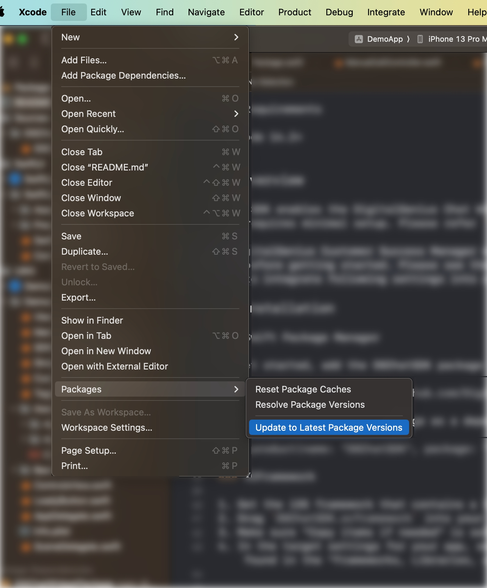

#  SPM TROUBLESHOOTING

### Note

When adding package use 'Up to next Major version' and version number from documentation.

### Package issues resolution

Most issues with SPM can be resolved with this instruction:
After adding Package make sure to call 'File -> Packages -> Update to latest package versions' as shown on screen shot below.

   

<!---->
